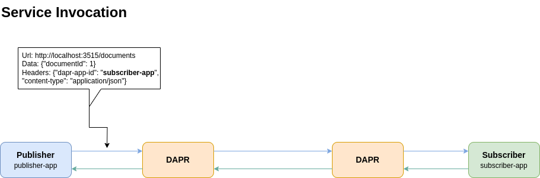

# 02. Service Invocation

Niniejszy przykład pokazuje metodę na wywołanie usługi przez inną usługę przekazując przez REST API wiadomość.
Przekazanie wykorzystuje dapr-a.



Poniższy przykład jest następujący. Są dwie aplikacje:
- **Publisher**, która wysyła wiadomość,
- **Subscriber**, która jest subskrybentem i nasłuchuje na odpowiednim endpoincie, czy przychodzą wiadomości.

## Subcriber

Aplikacja, która jest uruchomiona subskrybuje endpoint i wyświetla otrzymane wiadomości.

Przykładowy kod aplikacji ```subscriber/app.py``` jest następujący:

### Python
```python
from flask import Flask, request
import json
import logging
import os

logging.basicConfig(level=logging.DEBUG)

app = Flask(__name__)

app_port = os.getenv("APP_PORT", 8010)


@app.route("/documents", methods=["POST"])
def getDocuments():
    data = request.json
    print("Dokument otrzymany : " + json.dumps(data), flush=True)
    logging.debug("Dokument otrzymany : " + json.dumps(data))

    return json.dumps({"success": True}), 200, {"ContentType": "application/json"}


app.run(port=app_port)

```

### Instalacja bilbiotek i uruchomienie: 

#### Python

W katalogu ```subscriber``` należy:

1. Przygotować plik ```requirements.txt``` o zawartości:
   ```
   Flask
   dapr
   typing-extensions
   ```
2. Należy utworzyć środowisko wirtualne pythona i pobrać wymagane biblioteki
    ```bash
    $ python3 -m venv subscriber
    $ ./subscriber/bin/pip install -r requirements.txt
    ```
3. Po pobraniu bibliotek należy uruchomić aplikację poleceniem:
    ```bash
    $ sudo dapr run --app-port 8010 --app-id subscriber-app --app-protocol http --dapr-http-port 3510 -- ./subscriber/bin/python3 app.py
    ```

## Publisher

Aplikacja służąca wysyłaniu wiadomości, która będzie przechwytywana przez subskrybenta

Przykładowy kod aplikacji ```publisher/app.py``` jest następujący:

### Python
```python
import json
import time
import logging
import requests
import os

logging.basicConfig(level=logging.INFO)

base_url = (
    os.getenv("BASE_URL", "http://localhost")
    + ":"
    + os.getenv("DAPR_HTTP_PORT", "3515")
)
# Adding app id as part of the header
headers = {"dapr-app-id": "order-processor", "content-type": "application/json"}

for i in range(1, 20):
    order = {"orderId": i}
    url = "%s/orders" % (base_url)

    print("Url: {}".format(url))

    # Invoking a service
    result = requests.post(
        url="%s/orders" % (base_url), data=json.dumps(order), headers=headers
    )
    print("Order passed: " + json.dumps(order), flush=True)

    time.sleep(1)
```

W powyższym kodzie należy zwrócić uwagę na nagłówki żądania, a szczególnie na **```"dapr-app-id"```**, który wskazuje na nazwę aplikacji subskrybenta:
```json
{
    "dapr-app-id": "order-processor", 
    "content-type": "application/json"
}
```

### Instalacja bilbiotek i uruchomienie: 

#### Python

W katalogu ```publisher``` należy:

1. Przygotować plik ```requirements.txt``` o zawartości:
   ```
    requests
    typing-extensions
   ```
2. Należy utworzyć środowisko wirtualne pythona i pobrać wymagane biblioteki
    ```bash
    $ python3 -m venv publisher
    $ ./publisher/bin/pip install -r requirements.txt
    ```
3. Po pobraniu bibliotek należy uruchomić aplikację poleceniem:
    ```bash
    $ sudo dapr run --app-id publisher-app --app-protocol http --dapr-http-port 3515 -- ./publisher/bin/python3 app.py
    ```

## Uruchomienie obu aplikacji jednocześnie
Obie aplikacje mogą być uruchomione jednocześnie. W pliku głownym dla aplikacji pythona należy utworzyć plik ```dapr.yaml``` o zawartości:
```yaml
version: 1
apps:
  - appDirPath: ./subscriber/
    appID: subscriber-app
    appPort: 8001
    command: ["./subscriber/bin/python3", "app.py"]
  - appID: publisher-app
    appDirPath: ./publisher/
    command: ["./publisher/bin/python3", "app.py"]
```
Uruchomienie obu aplikacji następuje komendą:
```bash
$ sudo dapr run -f .
```